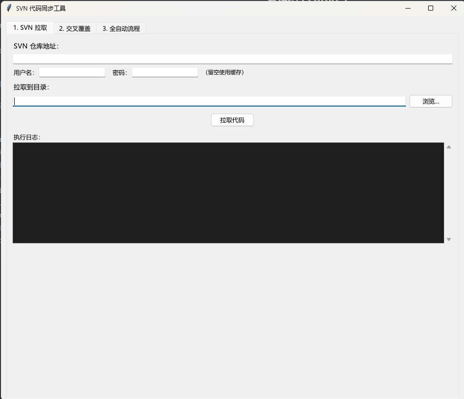

# SVN 代码同步工具 / SVN Code Sync Tool

一个跨平台（Windows / macOS）工具，用于从 SVN 拉取代码、用整理好的本地目录（或网络共享）覆盖交叉文件、并自动提交变更。三步流程一键完成，提交完成后可一键复制 SVN 提交记录。

提供两种使用方式：

- **图形界面**（`svn_sync_tool.py`）：Windows 主要使用方式，打包为 exe 分发。
- **终端版**（`svn_sync_cli.py`）：macOS 推荐使用方式，功能与 GUI 的 6 个标签页一一对应，支持交互式菜单和命令行参数两种用法，详见下方「终端版」章节。macOS 不再更新 `.app` 打包产物。

A cross-platform Windows GUI and macOS CLI tool for checking out code from SVN, overwriting cross-referenced files from a local organized directory (or network share), and automatically committing changes.

---

## 功能 / Features

| 功能 | 说明 |
|------|------|
| **SVN 拉取** | 输入 SVN 地址（支持中文路径），选择拉取目录，支持用户名/密码认证或缓存认证 |
| **交叉覆盖** | 遍历 SVN 检出目录下的每个文件，到整理好的目录中查找同名同路径文件，有则覆盖，没有则跳过 |
| **全自动流程** | 一键执行：SVN 拉取 → 交叉覆盖 → SVN 提交，实时日志输出，无需手动操作 |
| **升级清单提取** | 从复制的带颜色升级清单（QC 分组 + 红/黑标记的 SVN 文件 URL）提取文件清单，并生成人读升级 Markdown 与 AI 专用 Markdown |
| **版本号路径生成** | 快速完成这件事而设计的——不用打开 SVN log 界面一行行翻，提供一个版本号，工具直接查询出所有变更文件，并自动按 `(Vxxx)` 格式拼接好完整 URL |
| **标准文件获取** | 按源码清单从 KB/历史目录补全客户工作副本，提交前预览整个目标目录的 SVN 状态 |

| Feature | Description |
|---------|-------------|
| **SVN Checkout** | Enter SVN URL (supports Chinese characters), select checkout directory, supports username/password auth or cached auth |
| **Cross Overwrite** | Iterates every file in the SVN checkout directory, looks for matching files (same relative path) in the organized directory, overwrites if found, skips if not |
| **Auto Pipeline** | One-click execution: SVN checkout → cross-file overwrite → SVN commit, with real-time log output |
| **Upgrade List Extract** | Extract the file list from a copied colored upgrade list (QC groups + red/black-marked SVN URLs), and generate a human-readable upgrade Markdown and an AI-oriented Markdown |
| **Revision Path Generator** | Query changed files by SVN revision and generate complete URLs with `(Vxxx)` suffixes |
| **Standard File Acquisition** | Restore missing source files from KB/history directories and preview SVN status before commit |

---

## 截图 / Screenshot



> 此图为早期三标签页界面，仅供参考；当前 Windows GUI 已提供 6 个标签页。

---

## 下载 / Download

直接从 outputs/ 目录获取对应平台的预编译产物：

Grab the pre-built artifact for your platform from the outputs/ directory:

| 平台 | 产物 |
|------|------|
| **Windows** | `outputs/SVN_Sync_Tool.exe` |
| **macOS** | 推荐直接运行终端版源码 `python3 svn_sync_cli.py`（历史 `outputs/SVN_Sync_Tool-macos-arm64.zip` 不再更新） |

Windows exe 双击运行，无需安装 Python 或任何依赖（但系统需已安装 SVN 命令行工具）。macOS 终端版只依赖系统 Python 3 和 SVN 命令行工具，无需安装第三方包。

The Windows exe runs by double-click with no Python required. On macOS, run the terminal version (`python3 svn_sync_cli.py`) — it only needs Python 3 and the SVN CLI, no third-party packages.

---

## 终端版 / CLI（macOS 推荐）

`svn_sync_cli.py` 与 GUI 共用同一套业务逻辑，功能与 6 个标签页一一对应，两种用法：

### 交互模式

```bash
python3 svn_sync_cli.py
```

进入主菜单选择功能（1-6 对应 GUI 的 6 个标签页），随后按提示逐项输入参数：

- 常用值（SVN 地址、目录、用户名等，**不含密码**）会记住在 `~/.config/svn_sync_tool/cli.json`，下次回车即可复用；
- 密码输入不回显；来源为 `smb://` 共享时才会询问 SMB 账号；
- 交叉覆盖会先列出文件清单，回车全部覆盖，或输入序号（如 `1,3-5`）只覆盖部分，确认后才执行；
- 全自动流程执行前会显示参数摘要并要求确认；`checkout` 模式删除已有目录前会单独确认；
- 提交文件路径可复制到剪贴板；升级 Markdown 和版本号路径还可保存为文件。

### 参数模式（可脚本化）

```bash
# 1. SVN 拉取
python3 svn_sync_cli.py checkout --url https://svn.example.com/svn/cust/ecology --dir ~/work/ecology

# 2. 交叉覆盖（--dry-run 仅预览；非交互执行覆盖必须 --yes）
python3 svn_sync_cli.py overwrite --target ~/work/ecology --source 'smb://192.168.7.215/share/ecology' --dry-run
python3 svn_sync_cli.py overwrite --target ~/work/ecology --source ~/organized --yes

# 3. 全自动流程：拉取 → 覆盖 → 提交（非交互必须 --yes；--copy 完成后复制提交路径）
python3 svn_sync_cli.py auto --url ... --dir ~/work/ecology --source ~/organized -m "自动同步代码" --mode update --yes --copy

# 4. 升级清单提取（默认读剪贴板富文本；也可 --input 页面.html 或 --list 清单.txt）
python3 svn_sync_cli.py extract --format md -o upgrade-file-list.md
python3 svn_sync_cli.py extract --format ai-md -o upgrade-file-list-ai.md

# 5. 版本号路径生成
python3 svn_sync_cli.py paths --url https://svn.example.com/svn/cust/ecology -r "123,456-789 1000" --sort rev --copy

# 6. 标准文件获取（先预览；确认覆盖后显示整个目标目录的待提交状态）
python3 svn_sync_cli.py standard --url https://svn.example.com/svn/cust/ecology \
  --target ~/work/ecology --mode upgrade --title QC123 \
  --standard /path/to/kb --historical /path/to/history --list files.txt --dry-run
python3 svn_sync_cli.py standard --url https://svn.example.com/svn/cust/ecology \
  --target ~/work/ecology --mode upgrade --title QC123 \
  --standard /path/to/kb --historical /path/to/history --list files.txt --yes --commit --copy
```

在终端里漏填的必填参数会自动转为交互提问补全；非终端环境（如 CI）漏填则直接报错退出。各子命令详细参数见 `python3 svn_sync_cli.py <子命令> --help`。

---

## 使用说明 / Usage

### 标签页 1: SVN 拉取 / Tab 1: SVN Checkout

1. 输入 **SVN 仓库地址**
2. （可选）填写 **用户名** 和 **密码**，留空则使用本地 SVN 缓存认证
3. 选择 **拉取到目录**
4. 点击 **拉取代码**
5. 日志区域实时显示 svn checkout 输出

---

### 标签页 2: 交叉覆盖 / Tab 2: Cross Overwrite

1. 选择 **SVN 拉取目录**（目标，被覆盖的目录）
2. 选择 **整理好的目录**（来源，取文件的目录）——也可直接填**网络共享地址**（见下方「共享目录地址」）
3. 点击 **扫描预览** 查看哪些文件会被覆盖
4. 点击列表中的文件可切换勾选/取消
5. 点击 **覆盖选中** 执行覆盖

也可直接点击 **一键覆盖（推荐）**，扫描 + 覆盖一步完成。

---

### 标签页 3: 全自动流程 / Tab 3: Auto Pipeline

1. 填写 **用户名/密码**（可选）
2. 输入 **SVN 仓库地址**
3. 选择 **SVN 拉取目录**
4. 选择 **整理好的目录（来源）**——也可直接填**网络共享地址**（见下方「共享目录地址」）
5. 选择拉取模式：checkout（首次）或 update（已有）
6. 输入 **SVN 提交信息**
7. 点击 **▶ 一键执行**，工具将自动完成：
   ```
   SVN 拉取 → 交叉文件覆盖 → SVN 提交
   ```
8. 日志区域实时显示每一步的输出和结果

---

### 标签页 4: 升级清单提取 / Tab 4: Upgrade List Extract

从网页（如 QC 任务系统）复制的**带颜色升级清单**中，提取需要升级的文件并生成文档。清单中通常按 QC 分组，文件 URL 用**红色**标记需打包、**黑色**标记仅作上下文参考。

1. 在网页中复制带样式的升级清单（必须是富文本，不能是纯文本，否则丢失颜色）
2. 点击 **从剪贴板提取** —— 工具读取剪贴板 HTML，解析出按 QC 分组的清单（每行 `[red]/[black] + SVN URL`），显示在可编辑文本框中
3. 如需可手工微调清单内容（改动会带入后续生成）
4. 点击 **生成升级 Markdown** —— 生成人读的升级清单（按 QC 列出标题/模块/文件+版本+颜色标识）
5. 点击 **生成 AI Markdown** —— 生成 AI 执行用清单（按文件类型分类：源码迁移、二进制/SQL/生成物跳过，含统计与去重信息）
6. 用 **复制结果** / **另存为...** 导出生成的 Markdown

> 颜色语义：**红色 = 需迁移升级**（AI Markdown 中 `action: migrate`）；**黑色 = 上下文，跳过**（`action: skip` / `upgrade_scope: context-only`）。
>
> 剪贴板颜色读取分平台：macOS 用 `pbpaste -Prefer html` / NSPasteboard；Windows 读 `CF_HTML` 剪贴板格式。若剪贴板只有纯文本，会因缺少颜色而无法区分红/黑。

---

### 标签页 5: 版本号路径生成 / Tab 5: Revision Path Generator

用于按一个或多个 SVN 版本号查询变更文件，并生成带 `(V版本号)` 后缀的完整路径。

1. 填写 SVN 仓库地址及可选的用户名/密码
2. 输入单版本、多个版本或版本区间，如 `123`、`123,456`、`123 456`、`123-456`；多个版本可用英文逗号或空格分隔
3. 选择按版本、路径或文件名排序
4. 点击生成后复制结果；终端版还可用 `--output` 保存到文件

---

### 标签页 6: 标准文件获取 / Tab 6: Standard File Acquisition

用于在版本升级或二开任务中，补全客户 SVN 中缺失的源码文件。

1. 填写**任务标题**，选择任务类型：**升级任务**（upgrade）或 **二开任务**（secondev）
   - 升级任务：先查 KB 文件路径，未找到再查历史文件路径
   - 二开任务：仅查历史文件路径，KB 文件路径行自动隐藏
2. 填写**客户 SVN 地址**、**目标 SVN 目录**（已检出的客户 SVN 工作副本）
3. 填写 **KB 文件路径**（升级任务必填）和**历史文件路径**
4. 在**文件清单**中粘贴源码路径列表（每行一个，如 `src/com/api/.../DocAccService.java`），也可从剪贴板粘贴
5. 工具自动去 KB/历史文件路径的 `ecology/` 子目录下按相对路径查找
6. 点击 **扫描预览** 查看文件命中情况（可覆盖/内容相同/已存在跳过/未找到来源）
7. 点击 **确认覆盖** 将文件复制到目标 SVN 目录
8. 覆盖完成后可点击 **提交 SVN** 提交变更；提交成功后自动导出变更文件 URL 到日志，并可通过 **复制提交文件路径** 按钮一键复制
9. 支持 SMB 共享路径、UNC 路径作为来源目录；macOS 临时挂载时可填写 SMB 凭据，Windows 通常复用系统认证

> 来源查找优先级：`{KB路径}/ecology/{rel_path}` → `{KB路径}/{rel_path}` → `{历史路径}/ecology/{rel_path}` → `{历史路径}/{rel_path}`。目录条目（非文件）自动过滤。
>
> SVN 提交采用 Windows 兼容模式：只对本次覆盖文件执行 `svn add --parents`，随后展示整个目标 SVN 目录的 `svn status` 并二次确认。未版本控制（`?`）文件不会自动加入，但目录中其他已修改、已登记新增或删除的文件会一并提交。

---
## 共享目录地址 / Network Share

「整理好的目录（来源）」除了本地路径，也可以直接填**网络共享地址**。工具会按操作系统自动处理，**两个平台都无需手动改写路径**：

The "organized directory (source)" accepts a **network share address** in addition to a local path. The tool resolves it automatically per platform:

| 平台 | 支持的写法 | 处理方式 |
|------|-----------|---------|
| **Windows** | `\\server\share\path` 或 `smb://server/share/path` | 转成 UNC 路径**直接访问，无需挂载、无需填 SMB 账号**（系统按需建立连接） |
| **macOS** | `smb://server/share/path` 或 `\\server\share\path` | 自动挂载共享后访问；优先复用访达已连接的挂载（含深层挂载），临时挂载在退出时自动卸载 |

- **直接粘贴原文**：来源框可直接粘贴带提示语的整段文本，例如 `标准文件请到\\192.168.7.215\...\ecology下面提取`，工具会自动剥除「标准文件请到」「下面提取」等前后缀。
- **为什么有平台差异**：Windows 原生支持把 UNC 路径当本地路径访问；macOS 必须先把 SMB 共享挂载到文件系统才能用，`smb://` 本身只是 URL，不能当路径直接打开。
- **macOS 认证（两种方式）**：
  1. 在界面的 **SMB 账号 / 密码** 框填写凭据，工具用它挂载（凭据只存内存、不写入源码或安装包、日志不打印密码）；
  2. 或先在访达按 `Cmd+K` 输入 `smb://...` 连接一次（勾选「记住密码」存入钥匙串），工具自动复用该挂载，SMB 账号框留空即可。
- **深层挂载复用**：访达可把共享的深层子目录直接挂载（如挂到 `/Volumes/ecology`）；工具会比对挂载源的完整路径正确复用，并对中文路径做 Unicode/百分号编码归一化。
- **Windows 无需填 SMB 账号**：UNC 直接访问，SMB 账号/密码框留空即可。
- 本地路径（如 `/Users/...`、`C:\work\...`）按原有方式处理，行为不变。

---

## 构建 / Build from Source

### 前置条件 / Prerequisites

- **Python 3.10+**
- **requirements.txt 中的打包依赖**（PyInstaller、ttkbootstrap）
- **SVN CLI**（`svn` / `svn.exe` 需在 PATH 中；macOS 可用 Homebrew 安装：`brew install subversion`）

### 打包命令 / Build Command

**Windows**（单文件 exe）：

```bat
py -m pip install -r requirements.txt

REM 可选：直接从源码启动检查界面
py svn_sync_tool.py

REM 使用项目 spec 打包为单文件 exe（无控制台窗口）
py -m PyInstaller --clean --noconfirm SVN_Sync_Tool.spec

REM 产物在 dist\ 下，复制到 outputs\
copy /Y dist\SVN_Sync_Tool.exe outputs\SVN_Sync_Tool.exe
```

**macOS**：不再打包 `.app`，直接运行终端版即可：

```bash
python3 svn_sync_cli.py
```

> 如确需在 macOS 上运行图形界面（与 Windows 同一套代码），安装 `ttkbootstrap` 后运行 `python3 svn_sync_tool.py`。

> `build/`、`dist/` 均已在 `.gitignore` 中忽略；`SVN_Sync_Tool.spec` 纳入版本库，用于稳定收集 `ttkbootstrap` 打包资源。仓库只保留 `outputs/` 下的成品。

### 参数说明 / Arguments Explained

| 参数 | 说明 |
|------|------|
| `--onefile` | 打包为单个文件（Windows exe 常用） |
| `--windowed` | 不显示控制台窗口（GUI 程序专用） |
| `--name "SVN_Sync_Tool"` | 指定输出文件名 |
| `svn_sync_tool.py` | 入口脚本路径 |

---

## 技术栈 / Tech Stack

- **语言**: Python 3.10+
- **GUI**: tkinter / ttkbootstrap（基于 ttk）
- **SVN**: 通过 subprocess 调用系统 svn CLI
- **共享核心**: `svn_sync_core.py`（SVN、SMB/UNC、文件扫描等无界面能力）
- **打包**: PyInstaller（仅 Windows 持续更新 exe；macOS 直接运行 CLI）

> Windows exe 会内嵌 Python GUI 依赖（包括 `ttkbootstrap`），普通用户无需安装 Python、PyInstaller 或 pip 依赖；运行 SVN 功能仍需系统已安装 SVN 命令行工具。macOS 推荐直接使用系统 Python 运行 CLI。

---

## 项目结构 / Project Structure

```
.
├── .gitignore                          # Git 排除规则
├── AGENTS.md                           # 项目 AI 协作与维护规则
├── requirements.txt                    # 打包依赖
├── svn_sync_tool.py                    # Windows GUI 入口 + 升级清单解析/界面逻辑
├── svn_sync_cli.py                     # macOS 终端入口（交互菜单 + 6 个子命令）
├── svn_sync_core.py                    # GUI/CLI 共享的 SVN、SMB/UNC 与扫描核心
├── svn_path_generator.py               # 版本号路径生成（Tab 5 / paths 子命令）
├── svn_standard_file_core.py           # 标准文件扫描、覆盖与 SVN 提交业务层
├── svn_standard_file_tab.py            # 标准文件获取 GUI（Tab 6）
├── SVN_Sync_Tool.spec                  # PyInstaller 打包配置（Windows）
├── tests/
│   └── test_svn_standard_file_core.py  # 标准文件核心与真实临时 SVN 仓库测试
├── outputs/                            # 预编译成品（纳入版本库）
│   ├── SVN_Sync_Tool.exe               #   Windows 可执行文件
│   └── SVN_Sync_Tool-macos-arm64.zip   #   macOS 历史应用包（不再更新）
├── README.assets/                      # README 截图
└── README.md                           # 本文档
```

---

## 注意事项 / Notes

- 首次使用 SVN 功能时，如果未填写用户名/密码，会使用系统 SVN 缓存的认证信息
- 覆盖操作不可撤销，建议先在标签页 2 使用"扫描预览"查看变更
- 如果 SVN 服务器使用自签名证书，工具已默认添加 --trust-server-cert-failures 参数信任常见证书问题
- 来源目录支持直接填共享地址：Windows 用 `\\server\share`，macOS 用 `smb://server/share`，详见「共享目录地址」
- macOS 上由工具临时挂载的共享会在关闭窗口时自动卸载；访达手动连接的挂载不会被卸载
- 全自动流程提交成功后会列出本次提交文件的可访问 URL，可一键复制；提交解析使用 `svn info/log --xml`，不受中文（GBK/本地化）输出影响
- 若本次运行无变更（不产生新提交），会回退导出工作副本当前版本的文件路径，方便随时复制
- 部分 SVN 服务返回的中文仓库路径可能保留百分号编码（如 `%E5%A4%A9...`），不影响 URL 访问
- 源码打包环境要求 Python 3.10+（`ttkbootstrap` 依赖要求）；普通用户运行预编译产物无需安装 Python
