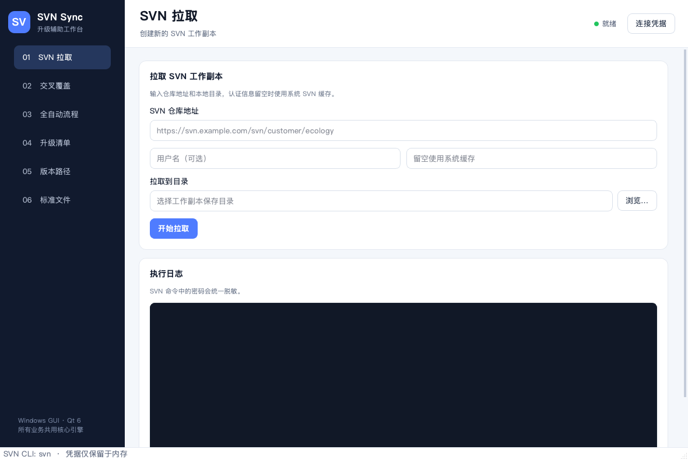

# SVN 代码同步工具 / SVN Code Sync Tool

一个跨平台（Windows / macOS）工具，用于从 SVN 拉取代码、用整理好的本地目录（或网络共享）覆盖交叉文件、并自动提交变更。三步流程一键完成，提交完成后可一键复制 SVN 提交记录。

提供四个入口：

- **现代图形界面**（`svn_sync_qt.py`）：Windows 主要使用方式，基于 PySide6 / Qt Widgets，打包为 exe 分发。
- **旧版图形界面**（`svn_sync_tool.py`）：保留为迁移期功能对照和回归入口，不再作为 Windows 正式打包入口。
- **终端版**（`svn_sync_cli.py`）：macOS 推荐使用方式，功能与 GUI 的 6 个页面一一对应，支持交互式菜单和命令行参数两种用法，详见下方「终端版」章节。也可直接使用 `outputs/SVN_Sync_Tool.app.zip` 中的图形界面。
- **Web 工具中心**（`svn_sync_web.py`）：提供“版本号路径生成”、“SVN 标准文件提交”和“升级清单提取”；SVN 任务使用隔离的临时工作副本/配置目录与用户自己的 SVN 凭据。默认仅监听 `127.0.0.1`，可通过显式参数开放可信局域网访问。

A Windows Qt GUI and macOS CLI tool for checking out code from SVN, overwriting cross-referenced files from a local organized directory (or network share), and automatically committing changes.

---

## 功能 / Features

| 功能 | 说明 |
|------|------|
| **SVN 拉取** | 输入 SVN 地址（支持中文路径），选择拉取目录，支持用户名/密码认证或缓存认证 |
| **交叉覆盖** | 遍历 SVN 检出目录下的每个文件，到整理好的目录中查找同名同路径文件，有则覆盖，没有则跳过 |
| **全自动流程** | 一键执行：SVN 拉取 → 交叉覆盖 → SVN 提交，实时日志输出，无需手动操作 |
| **升级清单提取** | 从复制的带颜色升级清单（QC 分组 + 红/黑标记的完整 SVN URL 或 `$/...` 路径）提取文件清单，并生成人读升级 Markdown 与 AI 专用 Markdown |
| **版本号路径生成** | 快速完成这件事而设计的——不用打开 SVN log 界面一行行翻，提供一个版本号，工具直接查询出所有变更文件，并自动按 `(Vxxx)` 格式拼接好完整 URL |
| **标准文件获取** | 按源码清单从 KB/历史目录补全客户工作副本，提交前预览整个工作副本的 SVN 状态；支持提交后恢复本地二开版本 |

| Feature | Description |
|---------|-------------|
| **SVN Checkout** | Enter SVN URL (supports Chinese characters), select checkout directory, supports username/password auth or cached auth |
| **Cross Overwrite** | Iterates every file in the SVN checkout directory, looks for matching files (same relative path) in the organized directory, overwrites if found, skips if not |
| **Auto Pipeline** | One-click execution: SVN checkout → cross-file overwrite → SVN commit, with real-time log output |
| **Upgrade List Extract** | Extract the file list from a copied colored upgrade list (QC groups + red/black-marked SVN URLs), and generate a human-readable upgrade Markdown and an AI-oriented Markdown |
| **Revision Path Generator** | Query changed files by SVN revision and generate complete URLs with `(Vxxx)` suffixes |
| **Standard File Acquisition** | Restore missing source files from KB/history directories and preview SVN status before commit |

---

## 截图 / Screenshot



> 此图为旧版界面，仅供历史参考；当前 Windows GUI 已改为左侧导航、卡片式配置和分栏结果区。

---

## 下载 / Download

直接从 outputs/ 目录获取对应平台的预编译产物：

Grab the pre-built artifact for your platform from the outputs/ directory:

| 平台 | 产物 |
|------|------|
| **Windows** | `outputs/SVN_Sync_Tool.exe` |
| **macOS** | `outputs/SVN_Sync_Tool.app.zip`（解压得到 `SVN_Sync_Tool.app`）；也可直接运行终端版源码 `python3 svn_sync_cli.py` |

Windows exe 双击运行，无需安装 Python 或任何依赖（但系统需已安装 SVN 命令行工具）。macOS 终端版只依赖系统 Python 3 和 SVN 命令行工具，无需安装第三方包。

The Windows exe runs by double-click with no Python required. On macOS, run the terminal version (`python3 svn_sync_cli.py`) — it only needs Python 3 and the SVN CLI, no third-party packages.

---

## 终端版 / CLI（macOS 推荐）

`svn_sync_cli.py` 与 GUI 共用同一套业务逻辑，功能与 6 个页面一一对应，两种用法：

### 交互模式

```bash
python3 svn_sync_cli.py
```

进入主菜单选择功能（1-6 对应 GUI 的 6 个页面），随后按提示逐项输入参数：

- 常用值（SVN 地址、目录、用户名等，**不含密码**）会记住在 `~/.config/svn_sync_tool/cli.json`，下次回车即可复用；
- 密码输入不回显；来源为 `smb://` 共享时才会询问 SMB 账号；
- 交叉覆盖会先列出文件清单，回车全部覆盖，或输入序号（如 `1,3-5`）只覆盖部分，确认后才执行；
- 全自动流程执行前会显示参数摘要并要求确认；`checkout` 模式删除已有目录前会单独确认；
- 全自动流程中任一文件覆盖失败都会立即终止，不会继续执行 `svn add` 或 `svn commit`；
- 生成的提交路径 / 升级 Markdown / 版本号路径可直接复制到剪贴板或保存为文件。

### 参数模式（可脚本化）

```bash
# 1. SVN 拉取
python3 svn_sync_cli.py checkout --url https://svn.example.com/svn/cust/ecology --dir ~/work/ecology

# 2. 交叉覆盖（--dry-run 仅预览；非交互执行覆盖必须 --yes）
python3 svn_sync_cli.py overwrite --target ~/work/ecology --source 'smb://192.168.7.215/share/ecology' --dry-run
python3 svn_sync_cli.py overwrite --target ~/work/ecology --source ~/organized --yes

# 3. 全自动流程：拉取 → 覆盖 → 提交（非交互必须 --yes；--copy 完成后复制提交路径）
python3 svn_sync_cli.py auto --url ... --dir ~/work/ecology --source ~/organized -m "自动同步代码" --mode update --yes --copy

# 4. 升级清单提取（默认读剪贴板富文本；也可 --input 页面.html 或 --list 清单.txt）
python3 svn_sync_cli.py extract --format md -o upgrade-file-list.md
python3 svn_sync_cli.py extract --format ai-md -o upgrade-file-list-ai.md

# 5. 版本号路径生成
python3 svn_sync_cli.py paths --url https://svn.example.com/svn/cust/ecology -r "123,456-789 1000" --sort rev --copy

# 6. 标准文件获取（先预览；确认覆盖后显示整个目标目录的待提交状态）
python3 svn_sync_cli.py standard --url https://svn.example.com/svn/cust/ecology \
  --target ~/work/ecology --mode upgrade --title QC123 \
  --standard /path/to/kb --historical /path/to/history --list files.txt --dry-run
python3 svn_sync_cli.py standard --url https://svn.example.com/svn/cust/ecology \
  --target ~/work/ecology --mode upgrade --title QC123 \
  --standard /path/to/kb --historical /path/to/history --list files.txt --yes --commit --copy
```

在终端里漏填的必填参数会自动转为交互提问补全；非终端环境（如 CI）漏填则直接报错退出。各子命令详细参数见 `python3 svn_sync_cli.py <子命令> --help`。

---

## 本地 Web 预览

Web 版当前包含三个相互隔离的工作区（顺序与页面导航一致）：

- **版本号路径生成**（01）：只读功能，直接复用 `svn_path_generator.py`，与 GUI Tab 5、CLI `paths` 子命令共用同一套版本号解析、`svn log` 查询、`(V版本)` URL 拼接和三种排序逻辑。只执行 `svn log`，不创建工作副本、不写入仓库；也可只对已有 `(V版本)` 路径做本地排序，此时完全不访问 SVN。打开页面时默认进入这个工作区。
- **SVN 标准文件提交**（02）：每个任务先读取客户 SVN 检出根的最新 HEAD，并将其固定为数字 revision；随后创建独立稀疏工作副本、匹配客户标准目录、覆盖并生成 `svn status` 预览。用户二次确认后才精确提交本次路径，成功后立即删除工作副本和独立 SVN 配置。失败、取消或 15 分钟未确认的任务也会清理，后台每 15 秒检查一次到期状态。
- **升级清单提取**（03）：直接复用 `upgrade_list_core.py`。服务端不读取主机剪贴板、不保存输入和生成结果；主动点击下载时，浏览器才会保存 Markdown。

标准文件工作区只允许用户填写固定共享根 `\\192.168.7.215\ECOLOGY_customer` 下形如 `分组\客户\QC编号\ecology` 的客户标准目录；不能填写其他服务器、本机绝对路径或任意共享。SMB 账号由服务端统一管理，浏览器不会接收或返回 SMB 凭据。

### 安装独立 Web 环境

```bash
python3 -m venv .venv-web
.venv-web/bin/python -m pip install -r requirements-web.txt
```

### 启动

先配置固定标准文件共享。若该共享已经挂载，可把挂载根配置为本地路径：

```bash
export SVN_SYNC_WEB_STANDARD_PATH='/Volumes/ECOLOGY_customer'
export SVN_SYNC_WEB_STANDARD_UNC_PREFIX='\\192.168.7.215\ECOLOGY_customer'
export SVN_SYNC_WEB_SOURCE_LABEL='E9 标准文件共享'

# 推荐同时限制网站允许连接的 SVN 前缀；多个前缀用逗号分隔
export SVN_SYNC_WEB_ALLOWED_SVN_PREFIXES='https://svn.example.com/svn/'
```

若尚未挂载，配置本机已有的 SMB 凭据文件。服务会读取其中的 `[standard]`，自动挂载并在任务间复用，服务停止时只卸载自己创建的临时挂载；该文件不得加入 Git：

```bash
export E9_SMB_CREDENTIALS_FILE='/绝对路径/e9-smb-credentials.toml'
```

也可使用 `SVN_SYNC_WEB_SMB_CREDENTIALS_FILE` 覆盖上述变量。多个固定来源 Profile 可使用 JSON 数组：

```bash
export SVN_SYNC_WEB_SOURCE_PROFILES='[
  {"id":"e9-default","label":"E9 标准文件共享","standard_path":"/Volumes/ECOLOGY_customer","unc_prefix":"\\\\192.168.7.215\\ECOLOGY_customer"}
]'
```

然后启动：

```bash
.venv-web/bin/python svn_sync_web.py
```

随后访问：`http://127.0.0.1:8765/`

需要让可信局域网内的用户访问时，使用显式局域网模式：

```bash
.venv-web/bin/python svn_sync_web.py --lan
```

随后可访问：`http://lzr-mac-mini.local:8765/`。服务会自动把当前主机名、`.local` 名称和解析到的 IPv4 地址加入可信 Host；若还需允许其他固定域名或 IP，可在启动前配置逗号分隔的 `SVN_SYNC_WEB_ALLOWED_HOSTS`。

页面支持：

- 从浏览器粘贴带颜色富文本，或读取本地 HTML 文件；
- 提取按 QC 分组的 `[red]` / `[black]` 清单；
- 在生成前手工校对清单；
- 生成人读 Markdown 与 AI Markdown；
- 在浏览器复制结果或下载 `.md` 文件；
- 下载文件自动使用客户名作为前缀，并清理 Windows / macOS 不支持的文件名字符；
- 加载内置示例快速体验升级清单流程；
- 标准文件清单只接受 `ecology` 下的相对文件路径，不解析 URL、`$/...` 或颜色标记；
- 清单非空时只覆盖列出的、且 SVN 与客户标准目录同时存在的文件；任一项只存在一端会阻止整个任务；
- 清单留空时必须额外勾选确认，服务会在该 SVN 最新 revision 与客户标准目录之间求文件交集，只覆盖交集，不会 `svn add` 标准目录独有文件；
- 每个 SVN 任务强制使用 `--config-dir`、`--no-auth-cache` 和 `--password-from-stdin`，不会读取或写入主机 SVN 认证缓存；
- 提交预览使用一次性确认令牌和幂等键，重复点击不会再次执行同一任务的 `svn commit`；
- 提交说明严格按输入原样写入 SVN，不追加任何内部标记；
- 检出根目录、目标文件和其祖先目录可以带任意自定义/未知 SVN 属性（客户 SVN 目录总量有明确上限，远小于下面的临时目录容量门禁，因此不再逐一按属性名预检）；仍然硬性拒绝的只有 `svn:keywords`（关键字替换会改变落盘内容）和 SVN 特殊文件（`svn:special`，如符号链接，需要与普通文件不同的处理方式），这两项与磁盘容量无关；`svn:eol-style` 会按约 2 倍估算容量，其余属性不影响容量估算；
- 默认最多同时执行 2 个任务、保留 10 个活跃任务，单任务临时目录上限 1 GiB；成功后立即清理。

版本号路径生成额外的 Web 侧约束（桌面版没有这些上限，因为它不对外提供服务）：

- 版本号只接受数字、逗号、空格和连字符；`0`、负数和无法解析的写法直接报错，不会静默忽略；
- 单次最多查询 200 个版本（每个版本都是一次 `svn log`），单次结果最多 20000 个文件；
- 单版本查询超时 60 秒，整次查询时间上限 240 秒；触发上限会返回已查到的结果，并明确说明有多少个版本没有查询；
- 同时最多执行 2 次查询，超出返回 429；
- 认证有两种模式，由是否填写凭据决定，只能二选一（只填一个会直接报错）：
  - **填写账号和密码**：使用独立 `--config-dir` 且 `--no-auth-cache`，密码经 stdin 传入，查询结束立即删除临时配置目录；
  - **两者都留空**：复用运行本服务这台机器上已缓存的 SVN 认证（与终端版“留空使用缓存”一致）。这条通道只用于只读查询，服务端用 SVN 子命令白名单硬性拦截，任何写操作（`commit` / `add` / `checkout` / `propset` 等）都会被拒绝并报 `read_only_engine_violation`。需要禁用时设置 `SVN_SYNC_WEB_ALLOW_HOST_SVN_CACHE=0`；
- 单个版本查询失败（例如版本不存在、无变更文件）只作为该版本的提示返回，不影响其余版本，错误文本经过凭据脱敏；
- **地址必须填仓库根**：`svn log` 返回的是仓库绝对路径，生成的 URL 由填入地址直接拼接该路径，填子目录会出现重复路径段。这与 GUI Tab 5、CLI `paths` 的行为一致。

> `--lan` 只适合受信任的内网临时使用。服务仍会校验 Host，并拒绝浏览器跨站写请求，但 HTTP 不加密浏览器到服务端之间的 SVN 密码。另外要注意：开启 `--lan` 后，局域网内任何人都能用**本机缓存认证**执行只读的版本号路径查询；不希望如此时设置 `SVN_SYNC_WEB_ALLOW_HOST_SVN_CACHE=0` 强制要求填写各自的账号。正式长期开放前仍应增加 HTTPS、登录会话和操作审计，不得暴露到公网。

Web 专项测试：

```bash
.venv-web/bin/python -m unittest \
  tests.test_web_upgrade_service tests.test_web_standard_service \
  tests.test_web_path_service tests.test_web_app -v
```

---

## 使用说明 / Usage

### 页面 1: SVN 拉取 / Page 1: SVN Checkout

1. 输入 **SVN 仓库地址**
2. （可选）填写 **用户名** 和 **密码**，留空则使用本地 SVN 缓存认证
3. 选择 **拉取到目录**
4. 点击 **拉取代码**
5. 日志区域实时显示 svn checkout 输出

---

### 页面 2: 交叉覆盖 / Page 2: Cross Overwrite

1. 选择 **SVN 拉取目录**（目标，被覆盖的目录）
2. 选择 **整理好的目录**（来源，取文件的目录）——也可直接填**网络共享地址**（见下方「共享目录地址」）
3. 点击 **扫描预览** 查看哪些文件会被覆盖
4. 点击列表中的文件可切换勾选/取消
5. 点击 **覆盖选中** 执行覆盖

也可直接点击 **一键覆盖**：工具先扫描并展示全部匹配文件，确认后再统一覆盖。

---

### 页面 3: 全自动流程 / Page 3: Auto Pipeline

1. 填写 **用户名/密码**（可选）
2. 输入 **SVN 仓库地址**
3. 选择 **SVN 拉取目录**
4. 选择 **整理好的目录（来源）**——也可直接填**网络共享地址**（见下方「共享目录地址」）
5. 选择拉取模式：checkout（首次）或 update（已有）
6. 输入 **SVN 提交信息**
7. 点击 **▶ 一键执行**，工具将自动完成：
   ```
   SVN 拉取 → 交叉文件覆盖 → SVN 提交
   ```
8. 日志区域实时显示每一步的输出和结果

---

### 页面 4: 升级清单提取 / Page 4: Upgrade List Extract

从网页（如 QC 任务系统）复制的**带颜色升级清单**中，提取需要升级的文件并生成文档。清单中通常按 QC 分组，完整 SVN URL 或 `$/仓库/路径(V版本)` 用**红色**标记需打包、**黑色**标记仅作上下文参考。

1. 在网页中复制带样式的升级清单（必须是富文本，不能是纯文本，否则丢失颜色）
2. 点击 **从剪贴板提取** —— 工具读取剪贴板 HTML，解析出按 QC 分组的清单（每行 `[red]/[black] + 完整 SVN URL 或 $/... 路径`），显示在可编辑文本框中
3. 如需可手工微调清单内容（改动会带入后续生成）
4. 点击 **生成升级 Markdown** —— 生成人读的升级清单（按 QC 列出标题/模块/文件+版本+颜色标识）
5. 点击 **生成 AI Markdown** —— 生成 AI 执行用清单（按文件类型分类：源码迁移、二进制/SQL/生成物跳过，含统计与去重信息）
6. 用 **复制结果** / **另存为...** 导出生成的 Markdown

> 颜色语义：**红色 = 需迁移升级**（AI Markdown 中 `action: migrate`）；**黑色 = 上下文，跳过**（`action: skip` / `upgrade_scope: context-only`）。
>
> 剪贴板颜色读取分平台：macOS 用 `pbpaste -Prefer html` / NSPasteboard；Windows 读 `CF_HTML` 剪贴板格式。若剪贴板只有纯文本，会因缺少颜色而无法区分红/黑。

---

### 页面 5: 版本号路径生成 / Page 5: Revision Path Generator

用于按一个或多个 SVN 版本号查询变更文件，并生成带 `(V版本号)` 后缀的完整路径。

1. 填写 SVN 仓库地址及可选的用户名/密码
2. 输入单版本、多个版本或版本区间，如 `123`、`123,456`、`123 456`、`123-456`
3. 选择按版本、路径或文件名排序
4. 点击生成后复制结果；也可粘贴已有 `(Vxxx)` 路径执行本地排序

---


### 页面 6: 标准文件获取 / Page 6: Standard File Acquisition

用于在版本升级或二开任务中，补全客户 SVN 中缺失的源码文件：按文件清单从 KB / 历史文件目录中定位文件，扫描预览后覆盖到已检出的客户 SVN 工作副本，确认后提交，并把提交文件 URL 一键复制到剪贴板。

1. 填写**任务标题**，选择任务类型：**升级任务**（upgrade）或 **二开任务**（secondev）
   - 升级任务：KB 文件路径（标准文件）→ 历史文件路径，按优先级查找来源
   - 二开任务：仅查历史文件路径，KB 文件路径行自动隐藏
2. 填写**客户 SVN 地址**、**目标 SVN 目录**（必须是已检出的客户 SVN 工作副本）；SVN 用户/密码留空时使用本机缓存认证
3. 填写 **KB 文件路径**（升级任务必填）和**历史文件路径**，支持本地路径、`\\` UNC 与 `smb://` 共享地址（来源填 `smb://` 时需填写 SMB 账号/密码）
4. 在**文件清单**中粘贴源码路径列表（每行一个），也可点击 **从剪贴板粘贴**：
   - 相对路径：`src/com/api/.../DocAccService.java`
   - SVN URL：`https://svn.example.com/svn/cust/ecology/src/...`（自动裁切为相对路径）
   - 本地全路径：`D:\...\ecology\src\...`（自动裁切为相对 ecology 路径，并作为「提交后覆盖本地」的本地源）
   - 自动剥除 `[red]` / `[black]` 颜色标记（含单独占一行的写法）与 `(Vxxx)` 版本号后缀；`#` / `//` 注释行、`QC` 开头的标题行和 `[black]` 上下文行自动跳过，可直接粘贴升级清单
5. 按需勾选：**允许覆盖已存在的文件**（默认勾选，取消后目标已存在的文件跳过）、**覆盖成功后自动进入提交准备**（默认勾选）
6. 点击 **扫描预览**，工具按优先级到各来源目录的 `ecology/` 子目录（及目录本身）查找，并显示四种命中状态：**待覆盖** / **内容相同**（来源与目标逐字节一致，无需覆盖）/ **跳过(目标已存在)**（未勾选允许覆盖）/ **未找到来源**
7. 点击 **确认覆盖** 将文件复制到目标 SVN 目录（执行前确认覆盖数量）
8. 点击 **提交 SVN 标准文件** 提交变更；提交信息自动生成为「任务标题 + 来源类型」（`标准文件` / `历史文件` / `标准文件/历史文件`）。提交成功后自动导出变更文件 URL（`{SVN地址}/{路径}(V{版本})`）到日志，并可通过 **复制提交文件路径** 一键复制
9. 提交完成后，如果文件清单里贴的是本地全路径，可点击 **提交后覆盖本地**，用这些本地文件覆盖目标 SVN 工作副本中对应的已提交文件；该操作只覆盖、不会再次提交 SVN

> 来源查找优先级（升级任务）：`{KB路径}/ecology/{rel_path}` → `{KB路径}/{rel_path}` → `{历史路径}/ecology/{rel_path}` → `{历史路径}/{rel_path}`；二开任务只查后两条。目录条目（非文件）自动过滤。
>
> SVN 提交采用 Windows 兼容模式：只对本次覆盖文件执行 `svn add --parents`，随后展示整个目标 SVN 工作副本的 `svn status` 并二次确认。未版本控制（`?`）文件不会自动加入，但目录中其他已修改、已登记新增或删除的文件会一并提交。
>
> 终端版对应 `standard` 子命令（主菜单项 6）：`--dry-run` 仅扫描预览、`--skip-existing` 跳过目标已存在文件、`--yes` 非交互确认覆盖、`--commit` 覆盖后提交、`--copy` 复制提交文件 URL。

---
## 共享目录地址 / Network Share

「整理好的目录（来源）」除了本地路径，也可以直接填**网络共享地址**。工具会按操作系统自动处理，**两个平台都无需手动改写路径**：

The "organized directory (source)" accepts a **network share address** in addition to a local path. The tool resolves it automatically per platform:

| 平台 | 支持的写法 | 处理方式 |
|------|-----------|---------|
| **Windows** | `\\server\share\path` 或 `smb://server/share/path` | 转成 UNC 路径**直接访问，无需挂载、无需填 SMB 账号**（系统按需建立连接） |
| **macOS** | `smb://server/share/path` 或 `\\server\share\path` | 自动挂载共享后访问；优先复用访达已连接的挂载（含深层挂载），临时挂载在退出时自动卸载 |

- **直接粘贴原文**：来源框可直接粘贴带提示语的整段文本，例如 `标准文件请到\\192.168.7.215\...\ecology下面提取`，工具会自动剥除「标准文件请到」「下面提取」等前后缀。
- **为什么有平台差异**：Windows 原生支持把 UNC 路径当本地路径访问；macOS 必须先把 SMB 共享挂载到文件系统才能用，`smb://` 本身只是 URL，不能当路径直接打开。
- **macOS 认证（两种方式）**：
  1. 在界面的 **SMB 账号 / 密码** 框填写凭据，工具用它挂载（凭据只存内存、不写入源码或安装包、日志不打印密码）；
  2. 或先在访达按 `Cmd+K` 输入 `smb://...` 连接一次（勾选「记住密码」存入钥匙串），工具自动复用该挂载，SMB 账号框留空即可。
- **深层挂载复用**：访达可把共享的深层子目录直接挂载（如挂到 `/Volumes/ecology`）；工具会比对挂载源的完整路径正确复用，并对中文路径做 Unicode/百分号编码归一化。
- **Windows 无需填 SMB 账号**：UNC 直接访问，SMB 账号/密码框留空即可。
- 本地路径（如 `/Users/...`、`C:\work\...`）按原有方式处理，行为不变。

---

## 构建 / Build from Source

### 前置条件 / Prerequisites

- **Python 3.10+**
- **requirements.txt 中的打包依赖**（PyInstaller、PySide6-Essentials；`ttkbootstrap` 仅供旧版 GUI 回归）
- **SVN CLI**（`svn` / `svn.exe` 需在 PATH 中；macOS 可用 Homebrew 安装：`brew install subversion`）

### 打包命令 / Build Command

**Windows**（单文件 exe）：

```bat
py -m pip install -r requirements.txt

REM 可选：直接从源码启动现代界面
py svn_sync_qt.py

REM 使用 Qt 专用 spec 打包为单文件 exe（无控制台窗口）
py -m PyInstaller --clean --noconfirm SVN_Sync_Tool.spec

REM 产物在 dist\ 下，复制到 outputs\
copy /Y dist\SVN_Sync_Tool.exe outputs\SVN_Sync_Tool.exe
```

**macOS**（应用包）：

```bash
python3 -m venv .venv-macos
.venv-macos/bin/python -m pip install -r requirements.txt

# 用 macOS 专用 spec 打包为 .app
.venv-macos/bin/python -m PyInstaller --clean --noconfirm SVN_Sync_Tool_macos.spec

# 压成 zip 后放入 outputs/（ditto 可保留可执行位与符号链接）
rm -rf outputs/SVN_Sync_Tool.app && cp -R dist/SVN_Sync_Tool.app outputs/
ditto -c -k --sequesterRsrc --keepParent outputs/SVN_Sync_Tool.app outputs/SVN_Sync_Tool.app.zip
```

也可以不打包，直接运行终端版或从源码启动图形界面：

```bash
python3 svn_sync_cli.py                    # 终端版
.venv-macos/bin/python svn_sync_qt.py      # 图形界面
```

> 两份 spec 不可混用：`SVN_Sync_Tool.spec` 是 Windows 单文件 exe（binaries/datas 内联进 EXE、开启 UPX）；`SVN_Sync_Tool_macos.spec` 是 macOS 应用包（`COLLECT` + `BUNDLE`、关闭 UPX，因为 UPX 会破坏 Mach-O 结构）。新增运行时资源时两份都要加进 `datas`。

> `build/`、`dist/` 均已在 `.gitignore` 中忽略；`outputs/*.app/` 也不入库，仓库只保留 `outputs/` 下的 `.exe` 与 `.app.zip` 成品。

### 参数说明 / Arguments Explained

| 参数 | 说明 |
|------|------|
| `--onefile` | 打包为单个文件（Windows exe 常用） |
| `--windowed` | 不显示控制台窗口（GUI 程序专用） |
| `--name "SVN_Sync_Tool"` | 指定输出文件名 |
| `svn_sync_qt.py` | 现代 GUI 入口脚本 |

---

## 技术栈 / Tech Stack

- **语言**: Python 3.10+
- **Windows GUI**: PySide6-Essentials / Qt Widgets（Qt 6）
- **旧 GUI 回归**: tkinter / ttkbootstrap
- **本地 Web**: FastAPI / Uvicorn / Jinja2（独立 `requirements-web.txt`）
- **SVN**: 通过 subprocess 调用系统 svn CLI
- **共享核心**: `svn_sync_core.py`、`svn_sync_workflow.py`、`svn_standard_file_core.py`、`upgrade_list_core.py`
- **打包**: PyInstaller（仅 Windows 持续更新 exe；macOS 直接运行 CLI）

> Windows exe 会内嵌 Python 与 Qt GUI 依赖，普通用户无需安装 Python、PyInstaller 或 pip 依赖；运行 SVN 功能仍需系统已安装 SVN 命令行工具。macOS 推荐直接使用系统 Python 运行 CLI。

---

## 项目结构 / Project Structure

```
.
├── .gitignore                          # Git 排除规则
├── AGENTS.md                           # 项目 AI 协作与维护规则
├── requirements.txt                    # 打包依赖
├── requirements-web.txt                # 本地 Web 与接口测试依赖
├── svn_sync_qt.py                      # 现代 Windows GUI 入口
├── qt_app.py / qt_pages.py             # Qt 主窗口、六个功能页面
├── qt_components.py / qt_theme.py      # Qt 通用组件与视觉主题
├── svn_sync_tool.py                    # 旧 Tk GUI 兼容入口
├── svn_sync_cli.py                     # macOS 终端入口（交互菜单 + 6 个子命令）
├── svn_sync_core.py                    # GUI/CLI 共享的 SVN、SMB/UNC 与扫描核心
├── svn_sync_workflow.py                # 拉取/覆盖/提交的无界面工作流编排
├── svn_path_generator.py               # 版本号路径生成（Tab 5 / paths 子命令）
├── svn_standard_file_core.py           # 标准文件扫描、覆盖与 SVN 提交业务层
├── upgrade_list_core.py                # 富文本升级清单解析与 Markdown 生成
├── clipboard_core.py                   # Windows/macOS HTML 剪贴板适配
├── svn_sync_web.py                     # Web 启动入口（默认本机，可显式开放局域网）
├── web_app.py / web_upgrade_service.py # Web API 与升级清单适配层
├── web_svn_common.py                   # Web 端共用的 SVN 地址校验、凭据校验与隔离引擎
├── web_standard_service.py             # Web 标准文件临时任务、凭据隔离与清理
├── web_path_service.py                 # Web 版本号路径生成（只读查询与本地排序）
├── web/                                # HTML 模板及本地 CSS/JavaScript
├── SVN_Sync_Tool.spec                  # Windows 单文件 exe 的 PyInstaller 配置
├── SVN_Sync_Tool_macos.spec            # macOS .app 应用包的 PyInstaller 配置
├── qt_assets/                          # Qt 样式表引用的图标资源（下拉箭头等）
├── tests/                              # 核心、安全门与职责边界回归测试
├── outputs/                            # 预编译成品（纳入版本库）
│   ├── SVN_Sync_Tool.exe               #   Windows 可执行文件
│   └── SVN_Sync_Tool.app.zip           #   macOS 应用包（解压即用）
├── README.assets/                      # README 截图
└── README.md                           # 本文档
```

---

## 注意事项 / Notes

- 首次使用 SVN 功能时，如果未填写用户名/密码，会使用系统 SVN 缓存的认证信息
- 覆盖操作不可撤销，建议先在页面 2 使用“扫描预览”查看变更
- 如果 SVN 服务器使用自签名证书，工具已默认添加 --trust-server-cert-failures 参数信任常见证书问题
- 来源目录支持直接填共享地址：Windows 用 `\\server\share`，macOS 用 `smb://server/share`，详见「共享目录地址」
- macOS 上由工具临时挂载的共享会在关闭窗口时自动卸载；访达手动连接的挂载不会被卸载
- 全自动流程提交成功后会列出本次提交文件的可访问 URL，可一键复制；提交解析使用 `svn info/log --xml`，不受中文（GBK/本地化）输出影响
- 若本次运行无变更（不产生新提交），会回退导出工作副本当前版本的文件路径，方便随时复制
- 源码打包环境要求 Python 3.10+；普通用户运行预编译产物无需安装 Python
